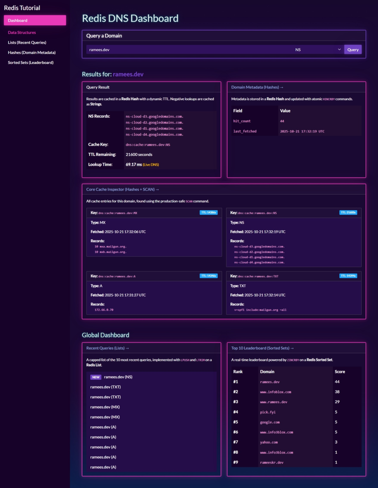

# Redis DNS Caching Tutorial & Dashboard

This project is a hands-on, interactive web application designed to teach core Redis data structures by building a practical, high-performance DNS caching system.

The application is a "tutorial dashboard" that not only performs real DNS lookups but also visualizes how different Redis data structures are used to cache results, track analytics, and manage data efficiently.



## Features

- **Real-time DNS Cache:** Performs live DNS lookups for `A`, `MX`, `TXT`, and `NS` records.
- **Intelligent Caching:**
  - Caches successful lookups in a **Redis Hash** with the record's real TTL.
  - Caches failed lookups (`NXDOMAIN`) in a **Redis String** (negative caching) to prevent repeated bad queries.
- **Central Dashboard:** The homepage provides a complete overview of the system's state, built with multiple Redis data types.
- **Deep-Dive Pages:** Each data structure has its own dedicated tutorial page explaining the "Why" (use case) and "How" (code and performance).

## Tech Stack

- **Backend:** Python 3, Flask
- **Database:** Redis
- **DNS:** `dnspython` library
- **Frontend:** Bootswatch (Vapor Theme)

## How to Run Locally

1.  **Clone the repository:**

    ```bash
    git clone [your-repo-url]
    cd [your-repo-directory]
    ```

2.  **Start Redis:**
    This project requires an active Redis server. The simplest way is with Docker:

    ```bash
    docker run -d -p 6379:6379 --name redis-dns-tutorial redis/redis-stack:latest
    ```

3.  **Set up the Python environment:**

    ```bash
    # Create a virtual environment
    python -m venv venv

    # Activate it
    # Windows
    .\venv\Scripts\activate
    # macOS/Linux
    source venv/bin/activate

    # Install dependencies
    pip install -r requirements.txt
    ```

4.  **Run the Flask application:**

    ```bash
    # This will run the app in debug mode
    flask --app app run --debug
    ```

5.  Open your browser to `http://127.0.0.1:5000` to see the application.

---

## Learning Guide: Redis Data Structures

This project is designed to teach Redis data structures by example. Here’s how each one is used.

### 1. Redis Strings

- **Use Case:** Negative Caching
- **How it Works:** When a DNS lookup fails (e.g., `NXDOMAIN`), we store a simple **String** key like `dns:nx:bad-domain.com:A` with a short TTL. This is extremely fast and lightweight.
- **Key Commands:** `SETEX` (to set with TTL), `GET` (to check).

### 2. Redis Lists

- **Use Case:** Recent Query Log
- **How it Works:** The "Recent Queries" widget on the dashboard is powered by a **List** key (`dns:recent`). Every query `LPUSH`-es the new domain to the front, and `LTRIM` is used to keep the list capped at 10 items.
- **Key Commands:** `LPUSH` (add to front), `LTRIM` (trim to size), `LRANGE` (read the list).

### 3. Redis Hashes

- **Use Case:** Caching DNS records and tracking metadata.
- **How it Works:** Hashes are used in two key places:
  1.  **Core Cache:** Successful DNS lookups are stored in a **Hash** (e.g., `dns:cache:google.com:A`) with fields like `records`, `fetched_at`, etc. This is perfect for storing an "object".
  2.  **Metadata:** The "Domain Metadata" widget uses a separate **Hash** (`dns:meta:google.com`) with `HINCRBY` to atomically increment a `hit_count` field, demonstrating a powerful analytics pattern.
- **Key Commands:** `HSET`, `HGETALL`, `HINCRBY`, and `SCAN` (to find all cache keys for a domain).

### 4. Redis Sorted Sets (ZSETs)

- **Use Case:** Popularity Leaderboard
- **How it Works:** The "Top 10 Leaderboard" is a **Sorted Set** (`dns:popularity`). Every query runs `ZINCRBY`, which atomically increments the "score" for that domain. Redis keeps the set sorted automatically.
- **Key Commands:** `ZINCRBY` (increment score), `ZREVRANGE` (get top 10).

---
